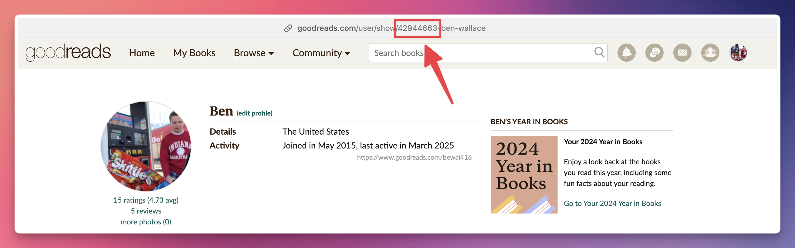

# Book Blend Backend
An API for Book Blend: Spotify Blend for books

The API is hosted on Render. Currently, the only endpoint is to
get all the books from a given Goodreads user_id and a given shelf
(defaults to `all`)

Example cURL:
```
curl --location 'https://book-blend-backend.onrender.com/books?user_id=42944663&shelf=all'
```
### Query Params
`user_id`: A Goodreads user id. It can be found by going to your
profile and identifying the string of number in the URL:



`shelf`: The Goodreads shelf you'd like retrieved. Could be one of
`all`, `to-read`, `currently-reading`, `read`, or a custom shelf
you've created.